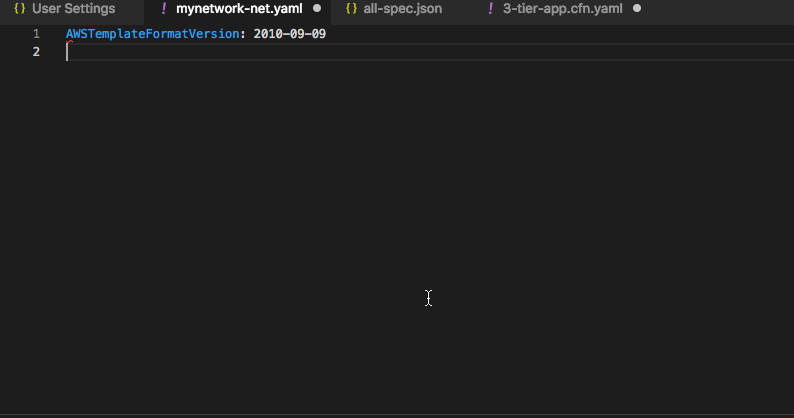

## AWS Cloudformation Template Schema

The CloudFormation template schema is intended to improve the authoring experience for our customers. 
It is a simple code process which converts our existing Resource Specifications files into a 
JSONSchema formatted document. This schema can be integrated into many publicly available IDEs 
such as Visual Studio Code & PyCharm to provide inline syntax checking and code completion.

## Key Features 

1. complete type safe template authoring with intellisence based completion.
1. Support for both YAML and JSON templates.
1. Errors flagged for missing required properties 
1. integrated deep links to CFN documentation pertinent to the resource you are editing

## How does an integration look like?

Here is a VSCode setup integration example


## How do i set it up?

For VSCode 

1. Install the [YAML validation]() and completion tool by redhat

CFN covers several hundreds of resources. The tool will generate json [draft07](https://json-schema.org/draft-07/schema) 
compliant schema for all AWS resources. However attempting to load the entire specification has its own challenges 
as it is huge (approx. 1.3M). In order to reduce the burden on the IDE, it is recommended that you generate targeted
resources for the application you are assembling.

### How i get targeted resource subset?

The tool is bundled with [config.yml](src/main/resources/config.yml) that provided a set of default bundles

- all: this generates it for the entire AWS service resources AWS::*
- networking: this includes all resources pertinent to AWS networking, setting up VPC, subnet, landing zones 
- 

## How to run the tool?

**Requirements**

- JDK >= 1.8, 
- Maven >= 3.x

**Building**

To build the project use standard mvn commands. Build standard package 

```
mvn package 
```

This will build into a single assembly executable. The tool can then be executed using 

```sh
java -jar target/json-schema-mapping-1.0-SNAPSHOT-jar-with-dependencies.jar
```

## Configuration 

The tool can be used to generate multiple groups of schemas as needed for particular purposes. Here is a sample
configuration file

```yaml
settings:
  draft: draft07
  regions: [us-east-2]
  output: cfn-schemas
  single: false

# https://docs.aws.amazon.com/AWSCloudFormation/latest/UserGuide/cfn-resource-specification.html
specifications:
  # US Region
  us-east-1: https://d1uauaxba7bl26.cloudfront.net/latest/gzip/CloudFormationResourceSpecification.json
  us-east-2: https://dnwj8swjjbsbt.cloudfront.net/latest/gzip/CloudFormationResourceSpecification.json
  us-west-1: https://d68hl49wbnanq.cloudfront.net/latest/gzip/CloudFormationResourceSpecification.json
  us-west-2: https://d201a2mn26r7lk.cloudfront.net/latest/gzip/CloudFormationResourceSpecification.json
  ap-south-1: https://d2senuesg1djtx.cloudfront.net/latest/gzip/CloudFormationResourceSpecification.json

  # Asia Pacific
  ap-northeast-3: https://d2zq80gdmjim8k.cloudfront.net/latest/gzip/CloudFormationResourceSpecification.json
  ap-northeast-2: https://d1ane3fvebulky.cloudfront.net/latest/gzip/CloudFormationResourceSpecification.json
  ap-southeast-1: https://doigdx0kgq9el.cloudfront.net/latest/gzip/CloudFormationResourceSpecification.json
  ap-southeast-2: https://d2stg8d246z9di.cloudfront.net/latest/gzip/CloudFormationResourceSpecification.json
  ap-northeast-1: https://d33vqc0rt9ld30.cloudfront.net/latest/gzip/CloudFormationResourceSpecification.json

  # CA
  ca-central-1: https://d2s8ygphhesbe7.cloudfront.net/latest/gzip/CloudFormationResourceSpecification.json

  # EU
  eu-central-1: https://d1mta8qj7i28i2.cloudfront.net/latest/gzip/CloudFormationResourceSpecification.json
  eu-west-1: https://d3teyb21fexa9r.cloudfront.net/latest/gzip/CloudFormationResourceSpecification.json
  eu-west-2: https://d1742qcu2c1ncx.cloudfront.net/latest/gzip/CloudFormationResourceSpecification.json
  eu-west-3: https://d2d0mfegowb3wk.cloudfront.net/latest/gzip/CloudFormationResourceSpecification.json

  # South America
  sa-east-1: https://d3c9jyj3w509b0.cloudfront.net/latest/gzip/CloudFormationResourceSpecification.json

groups:
  default:
    includes:
      - Tag

  networking:
    includes:
      - AWS::EC2.*
    excludes:
      - AWS::EC2::(Spot|Launch|Instance|Volume|Host).*

  serverless:
    includes:
      - AWS::ApiGateway.*
      - AWS::Lambda.*
      - AWS::IAM.*

  3tierAsgApp:
    includes:
      - AWS::ElasticLoadBalancingV2.*
      - AWS::RDS.*
      - AWS::AutoScal.*
      - AWS::IAM.*

  all:
    includes:
      - AWS.*

```

There is a default configuration that is bundled with the tool. Users of the tool can 
override specific configurations and merge with the default that is bundled with the tool. Here is a sample 

```yaml
groups:
  2-tier-rds-asg:
    includes:
      - AWS::RDS.*
      - AWS::Auto.*
      - AWS::IAM.*
      - AWS::EC2::Launch.*
      

```

The above configuration will produce a 2-tier-rds-asg-spec.json in addition to (networking|serverless|3tierAsgApp|all)-spec.json 
file in the cfn-schemas/us-east-2/ directory

## License

This library is licensed under the Apache 2.0 License. 
