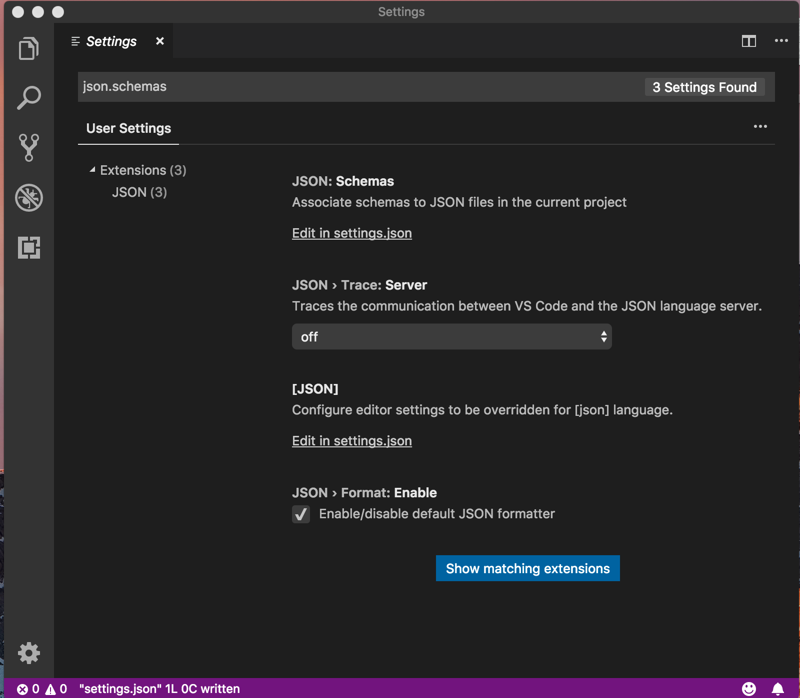

VSCode instructions 

**Install VSCode**

1. Install VS [code binary](https://code.visualstudio.com/). Here are links to [Windows](https://aka.ms/win32-user-stable), [macOS](ihttps://go.microsoft.com/fwlink/?LinkID=620882), [linux-debian](ihttps://go.microsoft.com/fwlink/?LinkID=760868)
2. Start VSCode, on macOS press CMD+<SPACE> and type __code__
3. Install [YAML support](https://marketplace.visualstudio.com/items?itemName=redhat.vscode-yaml) for VSCode. Here is the [github repo](https://github.com/redhat-developer/vscode-yaml)

**JSON/YAML Setup**

1. Edit "user.settings" on macOS CMD+, or click on Code -> Preferences -> Settings
2. In the search bar search for __json.schemas__ 
3. Click on __settings.json__
4. Cut-n-paste the following settings
```
{
    "[yaml]": {
        "editor.insertSpaces": true,
        "editor.tabSize": 2,
        "editor.quickSuggestions": {
            "other": true,
            "comments": false,
            "strings": true
        },
        "editor.autoIndent": true
    },
    "editor.renderWhitespace": "all",
    "editor.tabSize": 2,
    "editor.autoIndent": true,
    "yaml.format.enable": true,
    "yaml.trace.server": "verbose",
    "json.schemas": [
        {
            "fileMatch": [
                "*-cfn-us-east-1.json"
            ],
            "url": "https://s3.amazonaws.com/cfn-resource-specifications-us-east-1-prod/schemas/2.15.0/all-spec.json"
        }
    ],
    "yaml.schemas": {
        "https://s3.amazonaws.com/cfn-resource-specifications-us-east-1-prod/schemas/2.15.0/all-spec.json": "*-us-east-1-cfn.yaml"
    }
}
```
5. Create new file with the extension specified in the mapping network-cfn-us-east-1.json, or network-cfn-us-east-1.yaml. VSCode will use the mapping to determine code assist and more

**YAML Gotchas**

YAML is very whitespace sensitive for code completion. YAML LSP support does not deal with whitespace correctly. Here are tips to follow along if code completion isn't working as desired 

1. Ensure to get rid of all white spaces below the line you are editing (https://github.com/redhat-developer/vscode-yaml/issues/141)
2. Remember that you _can not_ edit in between. Editing towards the end is the only one works. You still will have some partial results but experience is subpar. This is true for all json schemas
